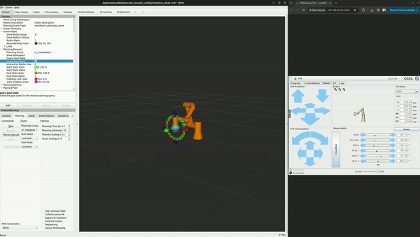
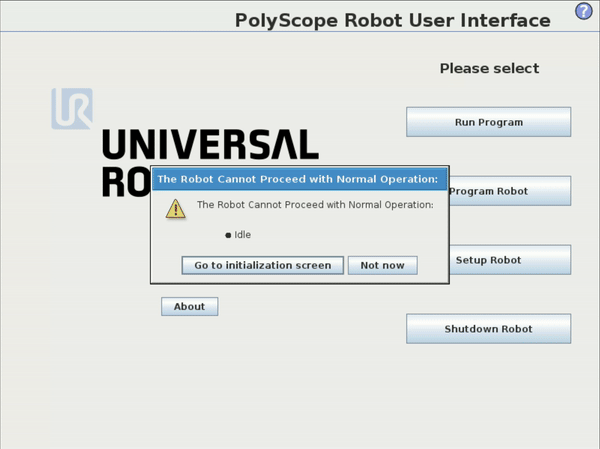

# UR Sim + MoveIt2

Simplified instruction for people starting out with ROS 2 to run a simulated Universal Robots UR3 inside a Docker container, access it through the browser and control it through  `ur_ros_driver` with MoveIt2.



## Getting started

### **Prerequisites**

Ensure your system is prepared with:

- **Ubuntu 22.04 LTS**
- **ROS 2 Humble Hawksbill**
- **MoveIt2**
  - [MoveIt 2 Binary Install](https://moveit.ros.org/install-moveit2/binary/)
- **Docker**
  - [Install Docker Engine](https://docs.docker.com/engine/install/)
- **Universal Robots ROS2 Driver**
  - [Install ros_humble_ur from binary packages](https://github.com/UniversalRobots/Universal_Robots_ROS2_Driver/tree/humble)
  - Make sure to install from the humble branch i.e. `sudo apt-get install ros-humble-ur`

### **Installation and Execution**

#### **Step 1: Clone the Repository**

Start by cloning the project repository to your local machine:

```bash
git clone https://gitlab.wmaut.de/k.siala/ur-sim-moveit2.git
```

#### **Step 2: Start the URSim**

Navigate to the script directory and execute the URSim startup script:

```bash
cd ur-sim-moveit2/script
./start_ursim.sh
```

- **Important**: Allow URSim approximately 10 seconds to initialize.
- Access the Polyscope interface via your web browser at: `http://192.168.56.101:6080/vnc.html`
- In Polyscope, activate the “external control” program. As shown here:



#### **Step 3: Launch the UR Driver and MoveIt**

Open a new terminal window to initiate the UR robot driver alongside MoveIt without launching RViz:

```bash
ros2 launch ur_robot_driver ur_control.launch.py ur_type:=ur3 robot_ip:=192.168.56.101 launch_rviz:=false
```

#### **Step 4: Activate the External Control Program**

Access the Polyscope interface via your web browser again and click on the `play` button in the bottom of the screen.

#### **Step 5: Initiate MoveIt2 and RViz**

In yet another terminal session, start MoveIt along with RViz for visualization:

```bash
ros2 launch ur_moveit_config ur_moveit.launch.py ur_type:=ur3 launch_rviz:=true
```

### **Notes and Tips**

- **Ensure Docker is Running**: Before starting the URSim, confirm that Docker is running.
- **Network Configuration**: Verify the network configuration allows for communication between your machine and the URSim container, particularly the IP address `192.168.56.101`.
- **ROS2 Environment**: Remember to source your ROS2 environment in every new terminal session with `source /opt/ros/humble/setup.bash` or add it to your `~/.bashrc` file for automatic sourcing.

## Support

Contact me if you get any problems while running it.

## Reference
These instructions were based on the official URSim Docker [Installation Guide](https://docs.ros.org/en/ros2_packages/rolling/api/ur_robot_driver/installation/ursim_docker.html).

## Disclaimer
_This project demonstrates how to use UR Sim by Universal Robots with MoveIt2 for education purposes. All copyrights, trademarks, and intellectual property rights belong to their respective owners. 
No infringement is intended. Please ensure compliance with all applicable licensing agreements and terms of use._

